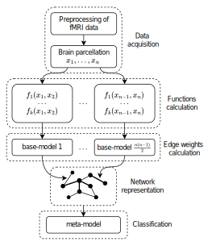

# Ensemble-Based Graph Representation of fMRI Data for Cognitive Brain State Classification
### Abstract
Understanding and classifying human cognitive brain states based on neuroimaging data remains one of the foremost and most challenging problems in neuroscience, owing to the high dimensionality and intrinsic noise of the signals. In this work, we propose an ensemble‐based graph representation method of functional magnetic resonance imaging (fMRI) data for the task of binary brain‐state classification. Our method builds the graph by leveraging multiple base machine‐learning models: each edge weight reflects the difference in posterior probabilities between two cognitive states, yielding values in the range [–1, 1] that encode confidence in a given state. We applied this approach to seven cognitive tasks from the Human Connectome Project (HCP 1200 Subject Release), including working memory, gambling, motor activity, language, social cognition, relational processing, and emotion processing. Using only the mean incident edge weights of the graphs as features, a simple logistic‐regression classifier achieved average accuracies from 97.07% to 99.74%. We also compared our ensemble graphs with classical correlation‐based graphs in a classification task with graph neural network (GNN). In all experiments, the highest classification accuracy was obtained with ensemble graphs. These results demonstrate that ensemble graphs convey richer topological information and enhance brain‐state discrimination. Our approach preserves edge-level interpretability of the fMRI graph representation, is adaptable to multiclass and regression tasks, and can be extended to other neuroimaging modalities and pathological‐state classification.

<figure>
  
  <figcaption>Pipeline of ensemble graph contraction and classification.</figcaption>
</figure>

### Modules
The code is divided into the following three folders:
```text
code/                     # Main code directory
├─ ensemble_graphs/       # Scripts for building ensemble graphs
├─ LogReg/                # Scripts for training and evaluating logistic regression
├─ GNN/                   # Scripts for training GNN models and comparing graphs
```

### Citation
If you use this code, please cite the following paper:

Will be added in the future.

### License
This project is licensed under the [MIT License](./LICENSE).
